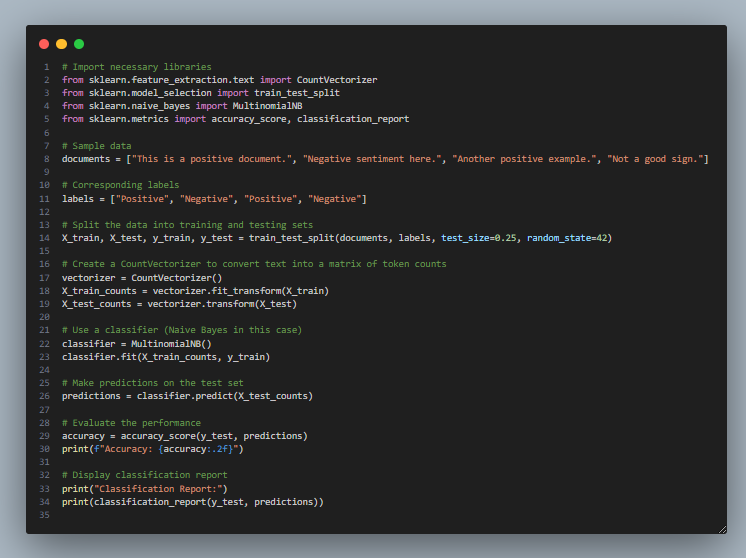
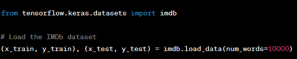
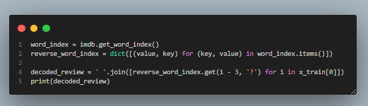
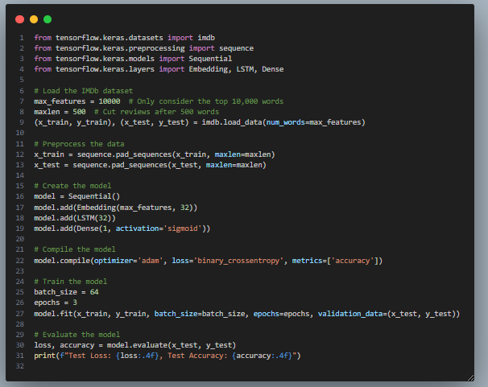

# **Text classification (Sentiment analysis)**
## **Written by:** Aarish Asif Khan
## **Date:** 13 January 2024 

> # **Introduction to Text classification**

- In the field of Natural Language Processing, one of the most important tasks is text classification. This
process involves assigning a category or tag to a given piece of text based on its content. 

- For example:

**In sentiment analysis we try to classify whether the text is positive, negative or neutral in nature.**

- Text classification is a common task in natural language processing (NLP) where the goal is to categorize text documents into predefined classes or categories. 

- Python offers several libraries and tools for text classification. One popular library is scikit-learn, which provides a simple and effective way to perform text classification.

> # **Basic example of Text classification using Scikit-Learn library!**

1. **Import necessary libraries**

In the above example, we first imported the neccessary libraries from sklearn. We also imported **train-test-split** to divide our data into training and testing split.

2. **Sample data**

We have a small set of example sentences (documents) and corresponding labels (positive or negative).

3. **Splitting the dataset**

This divides our data into a training set (for building the model) and a test set (for evaluating the model). The test_size=0.25 means 25% of the data is reserved for testing.

4. **Creating a Word Count Matrix**

A word count matrix represents each document as a vector where each element corresponds to the number of times to convert our raw text into numerical values that can be used for machine learning algorithms. 

The **fit_transform** is used on the training set, and **transform** is used on the test set.

5. **Training a Naive Bayes Classifier**

We choose a simple machine learning model called Naive Bayes and train it using the word count matrix from the training set.

6. **Making predictions**

Once the Naive Bayes model has learned from the training data, we use it to guess the labels for new, unseen text in the test set. This helps us check how well the model can handle data it hasn't encountered before.

7. **Evaluating the performance**

We calculate how accurate our model is by comparing its predictions to the actual labels in the test set. The classification_report provides more detailed information on performance.

In summary, this code shows a basic example of training a simple model to classify text as positive or negative and then evaluating how well it performs.

> # **The IMDB dataset (Internet Movies database)**

- The IMDb dataset is a popular dataset used in machine learning and natural language processing tasks.
 
- It typically refers to a collection of movie reviews from the IMDb website, where each review is labeled as positive or negative based on the sentiment expressed.

- The dataset is often used for tasks such as sentiment analysis, where the goal is to train a model to predict the sentiment of a given text (in this case, a movie review). 

- Researchers and developers use this dataset to build and evaluate machine learning models for text classification.

**Lets take a look at the IMDB dataset!**

- In order to fetch the IMDB dataset, you must have pythons libary tensorflow installed in your computer. In order to do that you have to go to your command prompt and type:

> **"pip install tensorflow"**

- To work with the IMDb dataset in Python, you can use the imdb module from the **tensorflow.keras.datasets** package.

-  This module provides functions to load the IMDb dataset. Here's a simple example:

> # **Explaining the code above**

- In this example, num_words=10000 means you want to keep only the top 10,000 most frequently occurring words in the dataset, discarding less common words. Adjust this parameter based on your specific needs.

- After loading the data, x_train and x_test contain lists of movie reviews, where each review is a list of integers representing word indices.
 
- y_train and y_test contain the corresponding sentiment labels (0 for negative, 1 for positive).

- Keep in mind that the IMDb dataset from Keras is already preprocessed, and the reviews are converted into sequences of word indices.

> **If you want to convert the indices back to words for readability, you can use the following code snippet:**

> # **How to create a machine Learning model by using the IMDB dataset**

> # **Explaining the code above**

**Loading Data:** 

* We load the IMDb dataset and limit it to the top 10,000 words (max_features). 

* We also limit the length of each review to 500 words (maxlen).

**Preprocessing Data:**

* We pad sequences to make sure they all have the same length.

**Creating the Model:**

* We use an Embedding layer to convert word indices to vectors.

* An LSTM layer processes the sequence of vectors.

* Finally, a Dense layer with a sigmoid activation function is used for binary classification (positive or negative sentiment).

**Compiling the Model:**

* We specify the optimizer, loss function, and metrics.

**Training the Model:**

* We train the model on the training data and validate it on the test data.

**Evaluating the Model:**

* We evaluate the model on the test set and print the test loss and accuracy.

**Conclusion**

This is a basic example, and you may need to adjust hyperparameters, model architecture, or use more advanced techniques depending on your specific requirements and the performance you aim to achieve.